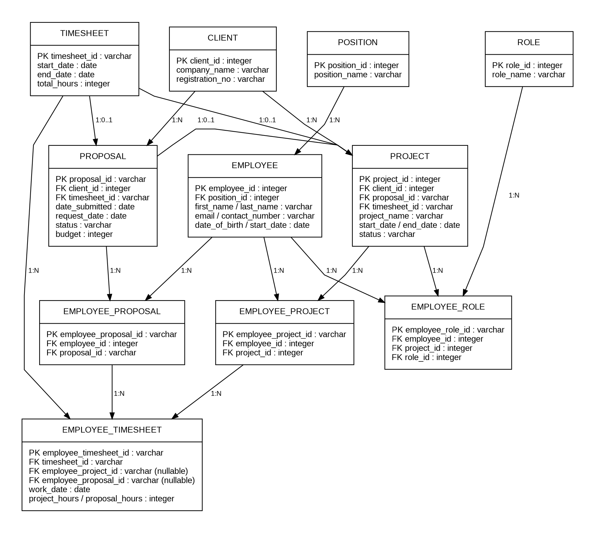

# Professional Services Project Management Database

**PostgreSQL relational database and SQL analytics case study**

This project models the operations of a professional-services company managing banking-sector clients, proposals, projects, employee assignments, roles, timesheets and project economics. The original business case focused on giving management a centralized way to understand resource use, proposal effort, client relationships and financial performance.

The public portfolio version restructures the original implementation into a clean, reproducible PostgreSQL project while preserving the underlying business rules and analytical questions.

## Business questions

The database is designed to answer questions such as:

- How many hours were spent on each client project and proposal?
- Which employees are assigned to a project, and how much time did each employee record?
- How long has the company worked with each client?
- How much effort was spent on accepted versus rejected proposals?
- How can project/proposal effort be summarized by year?
- What does an illustrative opportunity-cost calculation show about rejected proposal effort?

## Data model

The model separates master data, commercial activity and employee allocation:

- **Client / Proposal / Project** — client relationships and work pipeline.
- **Employee / Position / Role** — organizational structure and project-specific roles.
- **Employee Project / Employee Proposal** — many-to-many employee assignments.
- **Timesheet / Employee Timesheet** — summary and detailed work-effort records.



A Mermaid version is also provided in [`docs/erd.mmd`](docs/erd.mmd).

## Repository structure

```text
sql-project-management-database/
├── README.md
├── schema/
│   └── 01_schema.sql
├── data/
│   ├── README.md
│   ├── 02_seed_data.sql
│   ├── 03_load_employee_timesheet.sql
│   ├── employee_timesheet.csv
│   ├── timesheet_daily.csv
│   └── working_dates.csv
├── queries/
│   ├── 01_operational_reporting.sql
│   ├── 02_client_analysis.sql
│   ├── 03_employee_workload.sql
│   ├── 04_profitability_analysis.sql
│   ├── 05_yearly_performance.sql
│   └── 06_validation_checks.sql
└── docs/
    ├── erd.png
    ├── erd.svg
    ├── erd.mmd
    ├── refactoring_notes.md
    └── source_traceability.md
```

## SQL techniques demonstrated

- Relational schema design with primary and foreign keys
- One-to-many and many-to-many relationship modelling
- Constraints and indexes
- `JOIN`, `LEFT JOIN`, `FULL OUTER JOIN`
- Aggregation with `SUM`, `AVG`, `COUNT`
- Conditional aggregation and PostgreSQL `FILTER`
- Common Table Expressions (CTEs)
- `COALESCE`, `NULLIF`, `AGE`, `EXTRACT`
- Workload, client and profitability-oriented reporting
- Data-quality / orphan-record checks

## Cleaned data

The supplied detailed exports were retained and cleaned for portfolio use:

- **3,676** employee-level time entries
- **3,170** daily timesheet rows
- **556** working-date records

Cleaning standardizes headers and dates and removes export-only empty columns. The small relational reference tables are loaded from `02_seed_data.sql`.

## How to run

Requires PostgreSQL and `psql` for the CSV load helper.

```bash
createdb project_management
psql -d project_management -f schema/01_schema.sql
psql -d project_management -f data/02_seed_data.sql
psql -d project_management -f data/03_load_employee_timesheet.sql
```

Then execute any file from `queries/`.

> `03_load_employee_timesheet.sql` uses psql's `\copy` command and assumes the command is run from the repository root. Adjust the relative path if needed.

## Portfolio refactor

The original academic implementation shows the database evolving through multiple schema and datatype corrections. This repository presents the consolidated end state rather than the full debugging history. Important corrections and source-to-portfolio decisions are documented explicitly in [`docs/refactoring_notes.md`](docs/refactoring_notes.md).

The sample data are retained from the supplied exercise. Institution names are illustrative/public-reference entries from the project materials and should not be interpreted as confidential client data or evidence of real engagements.

## Portfolio context

This case study demonstrates how SQL can support an end-to-end business problem: translating operational requirements into a normalized relational model and then using that model for resource, client and management reporting.
